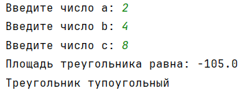
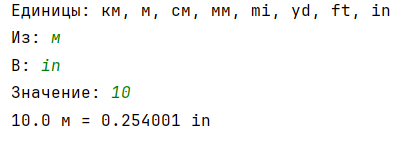
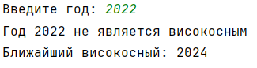
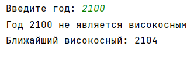

# Лабораторная работа №02 – GitHub

## Исполнитель
Баженов Данил \
Группа Фт-240008

## Среда разработки
Язык программирования: Python \
Среда разработки: PyCharm

# Задание №1 – Нахождение площади треугольника по 3 сторонам

Напишите программу, которая вычисляет площадь треугольника по трём его сторонам (по формуле Герона) с точность до сотых а также показывает какой это треугольник(тупоугольный/прямоугольный/остроугольный).

## Инструкция по работе

Необходимо запустить файл ``main1.py``, находящийся в каталоге ``/Площадь_треугольника``. По запросу программы требуется ввести длины 3-х сторон треугольника, после чего будет автоматически вычисленна его площадь по формуле Герона.

## Результаты тестирования

### Тест №1

### Тест №2

### Тест №3

# Задание №2 – Конвертер единиц измерения

Создайте программу-конвертер, которая переводит расстояние из одних единиц измерения в другие. Программа должна поддерживать следующие единицы: Километры (км), Метры (м), Сантиметры (см), Миллиметры (мм), Мили (mi), Ярды (yd), Футы(ft), Дюймы(in).

## Инструкция по работе

Необходимо запустить файл ``main2.py``, находящийся в каталоге ``/Конвертер_единиц_измерения``. Программа выведет список поддерживаемых единиц измерения расстояния, после чего предложит указать исходную и целевую единицы измерения, а так же само значение для перевода. Результатом работы будет переведенное значение с точностью до сотых.

## Результаты тестирования

### Тест №1

### Тест №2

# Задание №3 – Определение високосного года

Напишите программу, которая определяет, является ли введенный год
високосным, и показывает какой ближайший високосный год.

## Инструкция по работе

Необходимо запустить файл ``main3.py``, находящийся в каталоге ``/Определение_года``. Программа предложит ввести любой год, после чего скажет является ли этот 
год високосным и ближайший к нему високосный год. 

## Результаты тестирования

### Тест №1

### Тест №2

